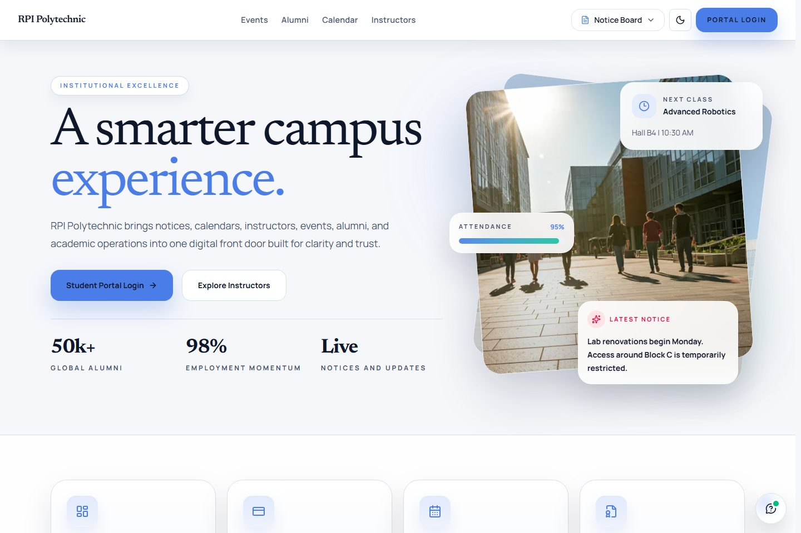
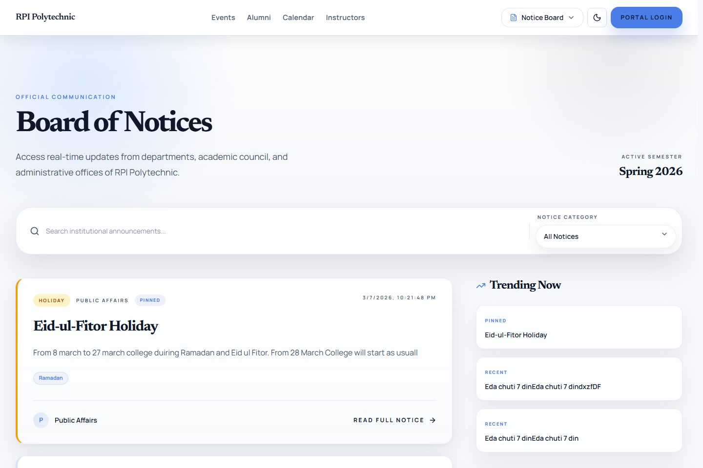
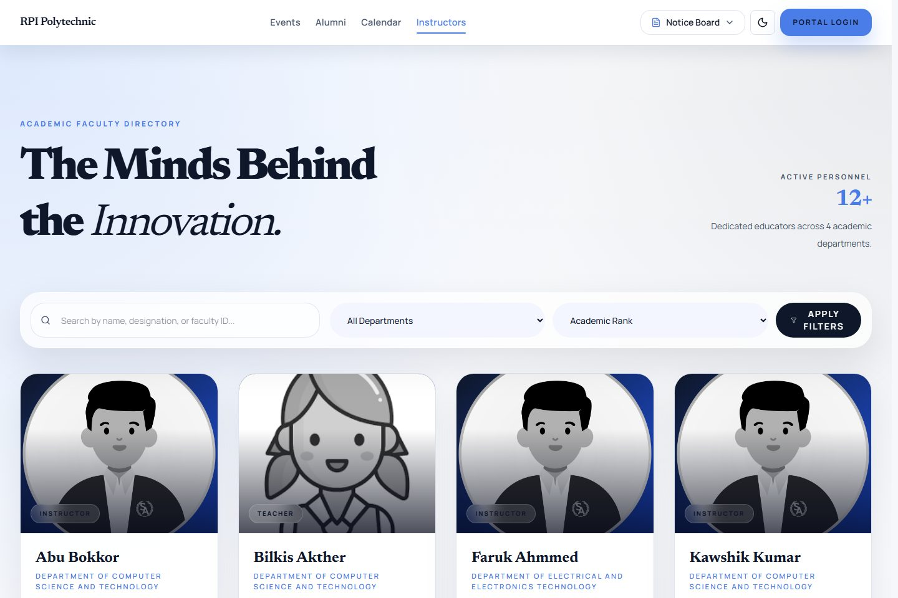
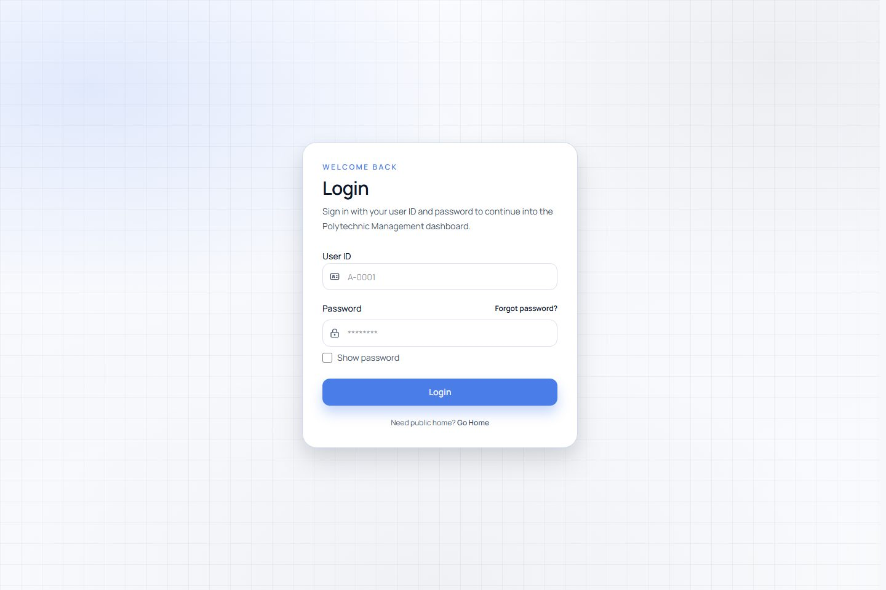
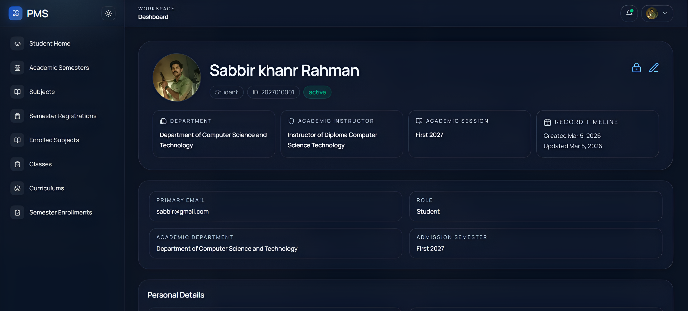
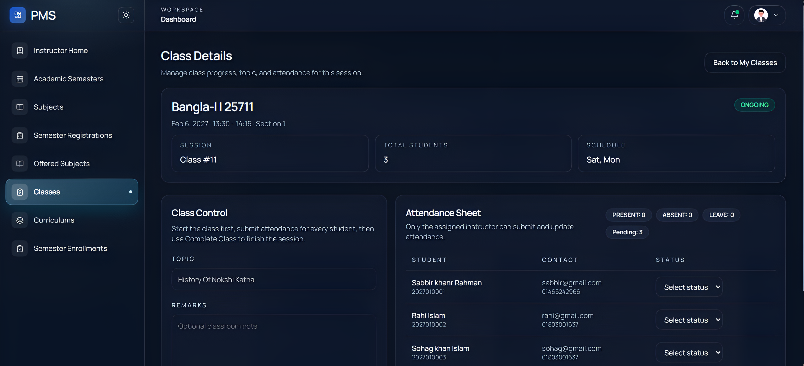
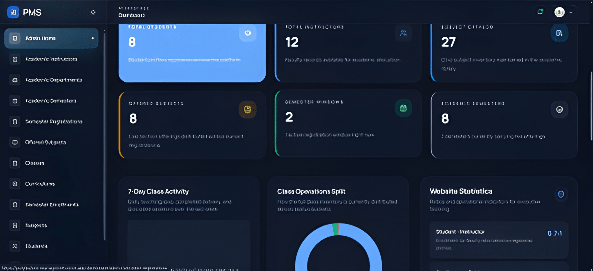

# Polytechnic Management System 

## 👨‍💻 Our Team

- 👤 **Mahafujur Rahman**  
- 👤 **Ruhul Amin**  
- 👤 **Foysal Ahmed**  
- 👤 **Sadat Rahman**  
- 👤 **Toha Khan**


Production-ready Academic ERP the Polytechnic Management System. This repository brings together a public institutional website and role-based dashboard experiences for `student`, `instructor`, `admin`, and `superAdmin` users in one interface.

## Project Overview

| Item | Details |
| --- | --- |
| Live Project | [https://polytechnic-managment.vercel.app/](https://polytechnic-managment.vercel.app/) |
| Frontend Scope | Public website + secure academic dashboard |
| Primary Users | Visitors, students, instructors, admins, super admins |
| Main Goal | Centralize notices, academic workflows, classroom visibility, and institutional communication |
| Current Status | Actively deployed on Vercel |

This frontend was designed to solve a very common institutional gap: public information usually lives in one place, while academic operations live somewhere else, and users end up juggling multiple systems. PMS Frontend turns that scattered experience into one connected platform.

## Problem Breakdown, Features, and Solutions

| Problem | Feature Added | Solution Outcome |
| --- | --- | --- |
| Institutional information was scattered across different pages, channels, or manual communication. | Public website pages for home, notices, events, academic calendar, academic instructors, and alumni. | Visitors can discover essential campus information from a single, accessible entry point. |
| Students needed one place to track their day-to-day academic flow. | Student dashboard with semester overview, class list, attendance summary, subject and enrollment flows, and notice highlights. | Students can quickly understand what is happening now, what is pending, and what requires action. |
| Instructors lacked a focused teaching overview. | Instructor dashboard with teaching assignments, semester coverage, and today's teaching queue. | Teaching workload becomes easier to track without hunting through multiple screens. |
| Admin operations were too broad to manage manually or from disconnected pages. | Admin dashboard with KPIs, charts, class monitor, and management modules for core academic data. | Admin users get a single operational control center for academic and platform workflows. |
| High-privilege users needed clearer access visibility. | Super admin overview with privileged account monitoring and admin management visibility. | Platform ownership and access governance become easier to supervise. |
| Free-hosted backend cold starts created confusion during the first visit. | Backend wake-up modal with retry state, timing logic, and user feedback. | Users understand the delay instead of assuming the system is broken. |
| Important updates needed to appear without manual refresh. | Socket.IO-powered realtime notifications with bell dropdown, unread tracking, and read/clear actions. | Users receive timely updates in a manageable and visible way. |
| Users expected a modern interface across different devices and themes. | Responsive layouts, theme persistence, motion-enhanced components, and shared UI patterns. | The product feels more polished and usable on both desktop and mobile. |

## Development Challenges We Overcame

The frontend was not only about adding pages. A big part of the work was solving product and UX problems during development:

1. Role-based routing had to be safe and predictable.
   We solved this with cookie-aware redirects, segmented dashboard routes, and forbidden handling so each user lands in the correct workspace.
2. The admin surface became large very quickly.
   We handled this by separating server loaders, API helpers, typed domain models, modal workflows, filters, and pagination patterns so modules stay consistent and scalable.
3. Realtime updates can easily become noisy.
   Instead of showing raw events, we built a notification system with unread counts, mark-as-read support, clear actions, and link-aware dropdown items.
4. Free hosting created a weak first impression because the backend could sleep.
   The wake-up modal was introduced to detect slow startup states, explain the issue, and let users retry gracefully.
5. Public pages and dashboard pages needed to feel like one product.
   Shared providers, theme persistence, motion patterns, and reusable UI structure helped keep the experience cohesive.

## Project Screenshots

The following screenshots were captured from the live deployment of this frontend.

### Public Website Views

| Home Page | Notices |
| --- | --- |
|  |  |

| Academic Instructors | Login Page |
| --- | --- |
|  |  |

### Dashboard and Workspace Views

| Student Profile | Instructor Class Details |
| --- | --- |
|  |  |

| Admin Dashboard Overview |
| --- |
|  |

## Features by User Type

### Public Visitors, Guardians, and Prospective Students

- Explore a polished landing page that introduces the institution clearly.
- Browse public notices, events, academic calendar updates, and alumni stories.
- View academic instructor listings and detail pages.
- Use the public chatbot for quick academic questions.
- Move directly to login from the public navigation when account access is needed.

### Students

- Access a student dashboard with current semester context, classes, attendance health, and notice highlights.
- Browse academic semesters, offered subjects, enrolled subjects, semester enrollments, and semester registrations.
- Open class details and track class status throughout the day.
- Manage profile information, image, and password from the profile area.
- Receive realtime notifications for important academic updates.

### Instructors

- Access an instructor dashboard focused on teaching load and current classroom activity.
- Review assigned subjects, offered subjects, semesters, and class schedules.
- Monitor today's teaching queue and scheduled or completed classes.
- Open relevant curriculum, subject, semester enrollment, and registration views.
- Use profile and notification tools for day-to-day account management.

### Admins

- Use a control dashboard with KPIs, charts, website statistics, and class monitoring.
- Manage students, instructors, academic instructors, departments, semesters, subjects, curriculums, offered subjects, semester registrations, semester enrollments, and notices.
- Filter, search, paginate, open details, and complete modal-based CRUD workflows.
- Review daily classroom flow from the class monitor.

### Super Admins

- Access all admin capabilities.
- Get additional visibility into admin leadership, access state, active and blocked users, and privileged account monitoring.

## Tech Stack

- Next.js 16 App Router
- React 19
- TypeScript
- Tailwind CSS v4
- TanStack Query
- Chart.js + react-chartjs-2
- Framer Motion
- GSAP
- React Hook Form
- Socket.IO Client
- Vitest
- Playwright

## Repository Layout

- `app/` - Next.js route tree for public pages, auth pages, dashboard routes, and API routes.
- `components/` - Shared UI, public sections, dashboard modules, notifications, and providers.
- `lib/` - API clients, domain types, auth helpers, socket helpers, and shared integrations.
- `actions/` - Server actions for dashboard write operations.
- `hooks/` - Reusable client hooks for dropdowns and admin helpers.
- `utils/` - Query builders, formatters, auth helpers, toast helpers, and dashboard utilities.
- `tests/` - Unit, component, and end-to-end test coverage.
- `docs/screenshots/` - README preview images captured from the live product.

## Key Environment Variables

Copy `frontend/.env.example` to `frontend/.env`, then use values that match your deployment:

```env
NEXT_PUBLIC_API_BASE_URL=https://your-backend-host/api/v1
NEXT_PUBLIC_SITE_URL=https://your-frontend-host
NEXT_PUBLIC_SOCKET_URL=https://your-backend-host
```

Notes:

- `NEXT_PUBLIC_API_BASE_URL` is required.
- `NEXT_PUBLIC_SITE_URL` is recommended for metadata and canonical URLs.
- `NEXT_PUBLIC_SOCKET_URL` is optional. If omitted, the socket host is derived from `NEXT_PUBLIC_API_BASE_URL`.

## Local Development

```bash
cd frontend
npm install
npm run dev
```

Default local URL:

```txt
http://localhost:3000
```

## Available Scripts

- `npm run dev` starts the local development server with Turbopack.
- `npm run build` creates the production build.
- `npm run start` serves the production build.
- `npm run lint` runs ESLint.
- `npm run test` runs Vitest.
- `npm run test:watch` runs Vitest in watch mode.
- `npm run test:e2e` runs Playwright end-to-end tests.
- `npm run test:e2e:list` lists available Playwright tests.

## Authentication and Session Notes

- Login and logout are handled through `/api/auth/login` and `/api/auth/logout`.
- Role-aware navigation depends on cookies such as `pms_access_token` and `pms_role`.
- Theme preference is stored using `pms_theme`.
- Dashboard access is segmented for `student`, `instructor`, `admin`, and `superAdmin`.

## Deployment Notes

The frontend is deployed on Vercel:

- Live URL: [https://polytechnic-managment.vercel.app/](https://polytechnic-managment.vercel.app/)

Recommended production setup:

1. Deploy the frontend to Vercel.
2. Point `NEXT_PUBLIC_API_BASE_URL` to the backend REST API.
3. Point `NEXT_PUBLIC_SOCKET_URL` to the backend host if realtime notifications are enabled.
4. Ensure the backend `CORS_ORIGINS` includes the frontend domain.

### Cold-Start UX Note

If the backend is hosted on a free tier that sleeps after inactivity, the frontend includes a wake-up modal on public routes. The modal only appears when the first health-check request is slow enough to affect user experience.

## Quality and Maintenance

This frontend is structured for ongoing growth:

- Route-level data assembly for dashboard experiences.
- Reusable domain types across modules.
- Clear separation between server-side and client-side API responsibilities.
- Responsive, theme-safe UI patterns.
- Dedicated providers for query state and realtime communication.
- Test coverage across unit, component, and e2e levels.

## Current Engineering Priorities

- expand end-to-end coverage for more role-based dashboard flows
- keep improving accessibility, empty states, and loading-state polish
- tighten deployment and onboarding documentation so the repo is easier to review quickly

## Demo Access

If you are using seeded local or controlled demo data, the following sample accounts may be available:

- Super Admin
  ID: `0001`
  Password: `admin12345`
- Admin
  ID: `A-0001`
  Password: `admin1234`
- Instructor
  ID: `I-0003`
  Password: `Instructor@123`
- Student
  ID: `2027010001`
  Password: `ruhul1234`

Use demo credentials only for local or controlled environments.
